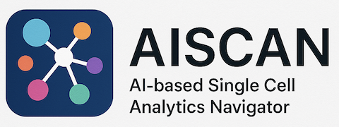
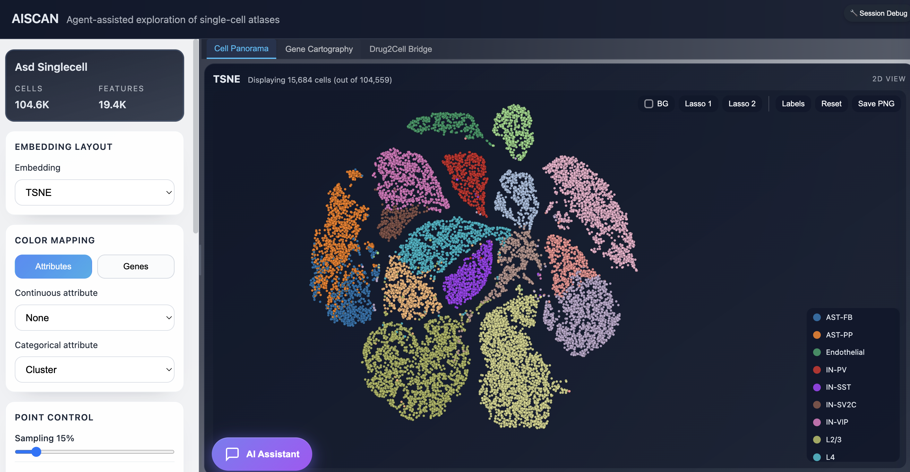

<p align="center">
  
</p>

# AISCAN (AI-based Single Cell Analytics Navigator)

## Project Layout

- `frontend/`: React-based single-page app that renders the exploration layout and AI assistant chat panel.


- `backend/`: FastAPI service exposing dataset endpoints and an AI assistant API surface that can integrate with the OpenAI Agents SDK.

## Getting Started

### step1: env setup

##### backend setup
``` bash
git clone https://github.com/jefferyUstc/AISCAN.git
cd AISCAN
conda create --name aiscan python=3.12
conda activate aiscan
pip install -r backend/requirements.txt
```


##### frontend setup
``` bash
cd frontend
npm install
```

### step2: config the variables and dataset

Configure the required environment before starting the backend service:

* set environment variables (see `backend/readme_model_config.md` for full LLM/provider options)
```bash
export OPENAI_API_KEY=sk-...
export AISCAN_LLM__MODEL_NAME="litellm/openai/gpt-4o"
```
* place the h5ad file in `backend/data`
* place the docs files (*.txt) in `backend/data/docs`

you could download one well-prepared example dataset from [zenodo](https://zenodo.org/records/18356503), download the  showcase data then put the files under `backend/data`.

See [frontend/README.md](frontend/README.md) and [backend/README.md](backend/README.md) for more instructions, and **`backend/readme_model_config.md`** for detailed LLM configuration (OpenAI / Anthropic / Gemini / gateways).


### step3: start AISCAN

```
python start_AISCAN.py
```

## AISACN interface
<p align="center">
  
</p>